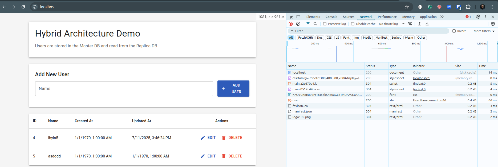
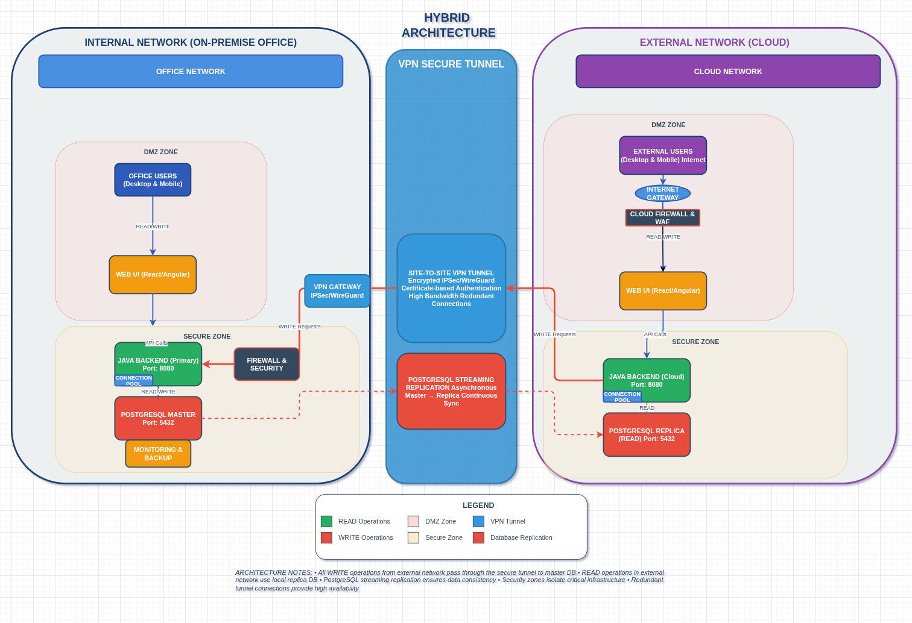

### Oumuamua project

The name "Oumuamua" is just a name of the prototype.





### Start

In 1st terminal:
```shell
./main.sh
```
In 2nd terminal:
```shell
./replica.sh
```

In 3rd terminal:
```shell
oumuamua-frontend/run.sh
```

Access:
http://localhost

Nginx proxy handles the requests. Reads go to replica, writes to main.
